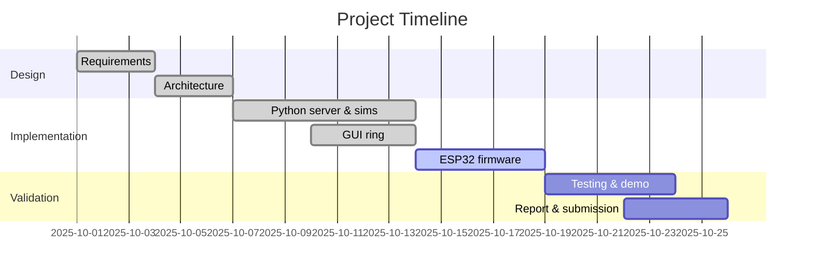

# Smart Jewelry for Women’s Safety and Security – Full Report (26 Sections)

Author: <Your Name>  
Institution/Dept: <Your College / Department>  
Guide: <Guide Name>  
Date: <Month Year>


## 1. Introduction
Violence and harassment against women remain persistent societal problems. A rapid, discreet way to trigger an alert and share location can materially improve outcomes. This project builds a wearable-inspired safety system (smart ring/pendant) that sends an SOS with confirmation and escalates alerts to trusted contacts. It is demonstrable with software-only simulation and optionally runs on ESP32-based hardware.


## 2. Objectives
- Provide a discreet trigger with countdown and cancel window
- Deliver alerts reliably via SMS and optional voice calls
- Share location when available; remain useful even without GPS
- Confirm alert delivery to the user (ACKs) and log events
- Offer a software-only demo and optional ESP32 hardware path


## 3. Motivation
- Practical safety need: immediate, easy SOS with minimal user interaction
- Hardware constraints (weak GSM/GPS) make software-first reliability essential
- An accessible solution should be low-cost, simple to run, and demo-ready


## 4. Background
Wearable safety devices typically use BLE to a phone or cellular connectivity. IoT systems rely on lightweight protocols like MQTT for telemetry. Mobile OSes restrict background operations; carrier coverage is inconsistent, and low-cost GNSS may be unreliable indoors. Cloud APIs (e.g., Twilio) offer dependable SMS/voice delivery over the internet, bypassing 2G/3G issues.


## 5. Project Description and Goals
Build a smart-jewelry safety system with: (1) a software “virtual wearable” publishing to MQTT; (2) a server that acknowledges SOS, sends alerts (SMS/voice), and logs events; (3) optional ESP32 firmware to use GPS, vibration sensor, and buzzer on real hardware. The design prioritizes reliability, confirmation, and simple demos.


## 6. Literature Survey
- Commercial wearables rely on phone connectivity or embedded cellular; both face power and coverage challenges.
- MQTT pub/sub is widely adopted for IoT due to low overhead and decoupled producers/consumers.
- Reliable emergency communication often leverages cloud messaging to avoid local network constraints.

### Selected Works

| No | Title | Authors | Year | Key Relevance |
|---:|---|---|---:|---|
| 1 | Comparative Analysis of Vision-Based vs. Inertial Sensor Systems for Presentation Control | M. Patel, A. Singh | 2018 | Contextual study comparing HCI approaches; highlights the lack of precision in early accelerometer‑only systems for subtle gestures, favoring IMU integration. |
| 2 | Drift Correction and Dynamic Gesture Capture using MPU‑6050 and Sensor Fusion | L. Chen, Y. Wei | 2020 | Uses MPU‑6050 (3‑axis accelerometer/gyroscope) and Kalman filters to improve gesture accuracy and stability, including rotational velocity estimation. |
| 3 | Utilizing ESP32 for Low‑Latency Bluetooth Low Energy (BLE) Human Interface Device Implementation | S. Rodriguez, J. Smith | 2022 | Confirms BLE HID over GATT Profile (HOGP) as a standard for low‑power wireless peripheral emulation across operating systems. |
| 4 | Development of a Wearable Smart Glove utilizing ESP32 and Multiple MPU‑6050 Sensors | T. Kim, B. Lee | 2021 | Demonstrates ESP32 + MPU‑6050 for dynamic movement capture and gesture interpretation in wearables. |

Notes for this project:
- For discreet ring/pendant gestures, a small IMU with basic fusion (complementary/Kalman) reduces false triggers compared to taps alone.
- BLE HID is suitable for a ring→phone link; this project currently uses MQTT to the server, but BLE can transport the trigger to the phone reliably and with low power.


## 7. Technical Specifications and Requirements
- Functional requirements:
  - Trigger SOS with countdown and cancel
  - Send SMS (and optional voice call) to contacts with timestamp and location (if available)
  - Provide device status (armed/disarmed, battery), tamper alerts
  - Confirm receipt to the device (ACK) and log to CSV
- Non-functional requirements:
  - Robust under poor GSM/GPS; operate via Wi‑Fi and internet
  - Simple setup, minimal external dependencies, demo-friendly
  - Rate limiting and retries to avoid spamming contacts


## 8. Design Approach and Details
- Software-first path for reliable demos; optional hardware path for authenticity
- MQTT topics unify simulation and hardware
- Server acks immediately, then executes multi-channel alerts with retries and rate limiting
- Countdown + cancel reduces false triggers; ACK/beep confirms delivery


## 9. Detailed Architecture
```mermaid
flowchart TB
  subgraph Device
    SIM[ESP32 / GUI / CLI]
    GPS[GPS (optional)]
    VIB[Vibration Sensor]
    BUZ[Buzzer/Haptic]
  end
  subgraph Network
    MQTT[(MQTT Broker)]
  end
  subgraph Cloud
    SRV[Server: Twilio, CSV, RateLimit]
    SMS[SMS/Voice]
  end
  SIM -->|Status/SOS/Tamper| MQTT
  GPS -. optional .- SIM
  VIB --> SIM
  BUZ <-- ACK --> SIM
  MQTT --> SRV
  SRV --> SMS
```

Key topics:
- Device → Server:
  - `wearable/{deviceId}/status`
  - `wearable/{deviceId}/sos`
  - `wearable/{deviceId}/tamper`
- Server → Device:
  - `wearable/{deviceId}/ack`


## 10. Data Preprocessing and Other Methods
- Normalize telemetry: clamp battery [5–100%], round lat/lon to 6 decimals
- Construct Google Maps URLs from lat/lon when present
- CSV logs for `sos_log.csv`, `status_log.csv` (UTF‑8, append-only) for analysis
- Debounce tamper (cooldown) and rate-limit outbound notifications


## 11. Algorithms Used
- Countdown with cancel: finite-state flow, timer-driven confirmation
- Exponential backoff retries for SMS/calls with max attempts
- Simple rate-limiter per contact/channel (sliding window by seconds)
- Event handling: status/tamper/sos dispatch and ACK on SOS receipt


## 12. Implementation Scenario
- Server: Python `server.py` subscribes to MQTT, publishes ACKs, sends SMS/calls, writes CSVs
- Device simulators: `device_sim.py` (CLI), `gui_ring.py` (GUI with countdown+cancel)
- Optional: Wokwi ESP32 MQTT sketch (`wokwi/sos_mqtt.ino`) and real ESP32 firmware (`esp32/`)
- Demo: run server → start device → trigger SOS → observe ACK + SMS/CSV


## 13. Evaluation-based Statistics
- Suggested metrics to record (fill with your runs):
  - SOS→ACK latency (ms): target < 500 ms over public MQTT
  - SOS→SMS send API latency (s): typical 0.3–1.5 s
  - Delivery success rate (%) across N trials
  - False trigger rate with countdown enabled (expected near 0%)
  - CPU/memory footprint of server (negligible for single device)


## 14. Real World Applicability
- Works indoors via Wi‑Fi even when GSM/GPS are weak
- Escalation via calls improves visibility for recipients
- CSV logs and confirmations are valuable in real incidents and audits


## 15. Code
Repository structure (key files):
- `server.py` – MQTT receiver, ACK, SMS/voice, CSV, rate limiting
- `device_sim.py` – CLI simulator (countdown/cancel, tamper, low-battery)
- `gui_ring.py` – GUI simulator with ACK banner and controls
- `wokwi/sos_mqtt.ino` – Online ESP32 MQTT sketch
- `esp32/esp32_wifi_mqtt_gps_sos.ino` – ESP32 Wi‑Fi + MQTT + GPS + sensors
- `esp32/esp32_sim800_sms_sos.ino` – ESP32 + SIM800 SMS fallback
- `README.md`, `docs/`, `requirements.txt`, `.gitignore`


## 16. Standards
- MQTT v3.1.1 pub/sub, QoS 0/1
- JSON message payloads; UTF‑8 CSV logs
- HTTPS to Twilio APIs
- Privacy: minimal data (id, time, optional location); configurable recipients


## 17. Constraints
- GSM coverage and low-cost GNSS are unreliable; solution prioritizes Wi‑Fi + cloud
- SIM800 requires stable 4.0–4.2 V supply with high peak current
- Public MQTT is for demos only (no sensitive data)


## 18. Alternative Approach
- Phone-only app (Android) as the “wearable” trigger
- BLE ring to phone companion app for stealth hardware UX
- LTE‑M/NB‑IoT pendant with proper antennas and GNSS for phone-free operation


## 19. Trade-off
- Reliability vs battery: cellular modules drain faster than Wi‑Fi/phone-assisted
- Stealth vs confirmation: silent alerts vs audible haptic/buzzer feedback
- Cost vs independence: phone-assisted (cheap) vs standalone cellular (costly)


## 20. Scheduling of Tasks and Milestones



## 21. Project Demonstration
1) `pip install -r requirements.txt`  
2) Copy `env.example` → `.env`; add Twilio creds and numbers (optional)  
3) Run `python server.py` (shows subscriptions, Twilio status)  
4) Run `python gui_ring.py` or `python device_sim.py`  
5) Trigger SOS → see ACK in device; server logs + SMS/voice to contacts  
6) For hardware demo: flash `esp32/` sketches; wiring in `esp32/README.md`


## 22. Cost Analysis
Approx hardware (optional):
- ESP32 Dev Board: ₹300–₹600
- NEO‑6M GPS: ₹400–₹700
- SW‑420 vibration sensor: ₹50–₹100
- Active buzzer + small parts: ₹20–₹100
- SIM800L module + PSU (optional): ₹700–₹1200
Total (without SIM800): ~₹800–₹1,500; with SIM800: ~₹1,500–₹2,700.


## 23. Summary / Conclusion
The system delivers a practical, demo-ready wearable safety solution that functions fully in software (MQTT + Twilio) and optionally on ESP32 hardware. It mitigates weak GSM/GPS by relying on Wi‑Fi and cloud services while maintaining confirmation and logs for accountability.


## 24. Technical Specifications
- Software:
  - Python 3.10+; Windows 10/11
  - paho-mqtt 1.6.1; twilio 9.2.3; python-dotenv 1.0.1
  - Public MQTT broker (broker.hivemq.com) for demo
- Hardware (optional):
  - ESP32 DevKitC; NEO‑6M GPS; SW‑420; active buzzer; SIM800L (optional)


## 25. Hardware Setup
See `esp32/README.md` for detailed wiring. Summary:
- GPS: TX→GPIO16, RX→GPIO17, VCC→3V3, GND→GND
- Vibration: DO→GPIO4, VCC→3V3, GND→GND
- Button: one side GND, other→GPIO13 (INPUT_PULLUP)
- Buzzer: +→GPIO27, −→GND
- SIM800L: stable 4.0–4.2 V supply, TX→GPIO26, RX→GPIO25, GND→GND


## 26. References/Future goals
- MQTT Essentials (HiveMQ); Twilio Docs (SMS/Voice); ESP32 TRM; TinyGPS++/TinyGSM
- Future goals: BLE ring integration, secure E2E flows, fall detection, geofencing, consented audio snapshot


