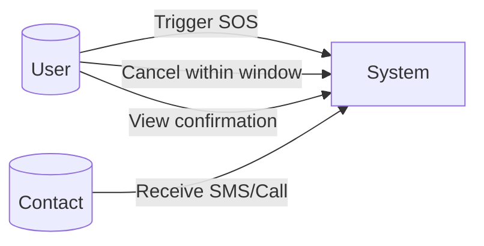
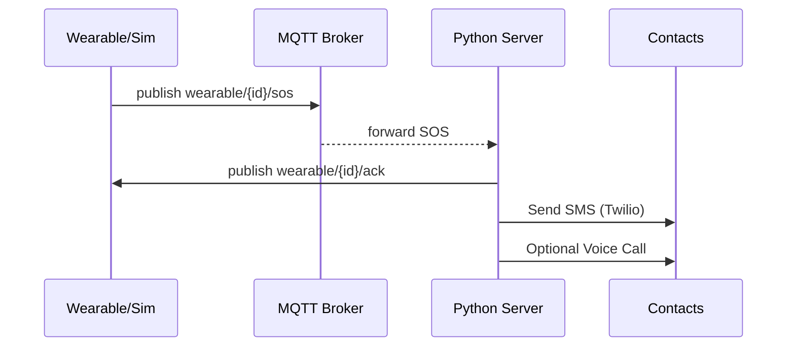
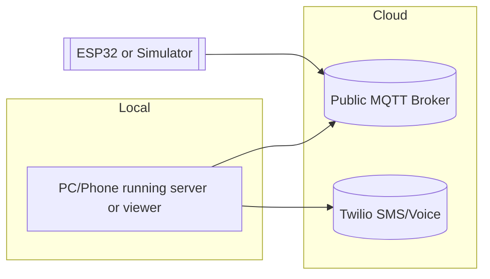
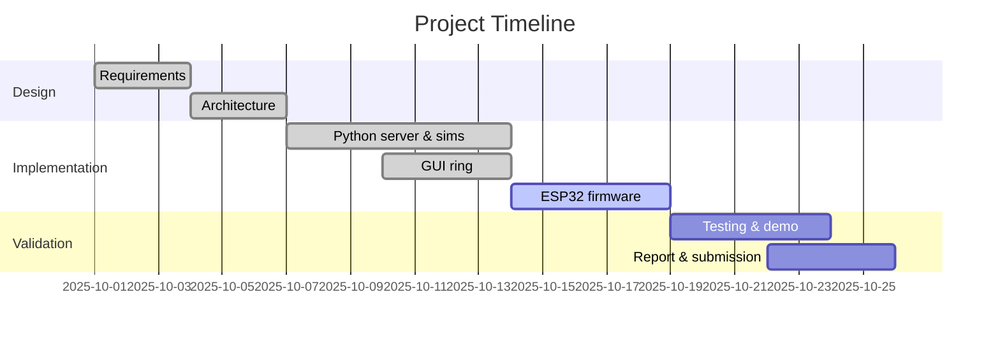

# Smart Jewelry for Women's Safety and Security

Author: <Your Name>
Institution/Dept: <Your College / Department>
Guide: <Guide Name>
Date: <Month Year>


## Abstract
This project presents a wearable safety solution for women in the form of smart jewelry (ring/pendant). The system enables a discreet SOS trigger that shares live location and alerts trusted contacts. To mitigate unreliable low‑cost GSM/GNSS hardware, the project provides two robust operation modes: (1) a software‑only “virtual wearable” using Wi‑Fi + MQTT and a phone/cloud for messaging; (2) optional ESP32 firmware for real hardware with GPS/vibration/buzzer (Wi‑Fi MQTT) and a fallback SIM800 SMS mode if available. The implementation includes a complete IoT pipeline, a GUI simulator, CSV logging, Twilio SMS/calls, and detailed safety measures such as countdown‑with‑cancel, ACK confirmation, tamper detection, and rate‑limited escalation.

Keywords: Wearable safety, smart jewelry, IoT, MQTT, ESP32, Twilio, SOS, location sharing


## 1. Introduction
- Problem: Women often face unsafe situations where a discreet, reliable distress alert is critical.
- Goal: Provide a wearable‑inspired system that triggers an SOS event with minimal friction, confirms delivery, and shares location to trusted contacts.
- Constraints: Cheap GSM modules and 2G availability are unreliable in many regions; GPS signals can be weak indoors.
- Approach: Deliver a complete, demonstrable solution without depending on fragile hardware—use a software‑first design with optional real hardware.


## 2. Objectives
- Discreet trigger flow with countdown/cancel and haptic/audio feedback.
- Live location sharing and confirmation ACKs.
- Multi‑channel alerts: SMS and optional voice calls (Twilio).
- Tamper and low‑battery notifications.
- Software‑only demo plus optional ESP32 firmware, with consistent MQTT topics.


## 3. Literature Review (Brief)
- Wearable safety devices (commercial and academic) typically use BLE to phone or cellular on-device. Reliability and power constraints are dominant challenges.
- IoT backends often employ MQTT for lightweight pub/sub with device→server telemetry.
- Background restrictions in mobile OS and poor 2G coverage affect dependable emergency delivery; cloud‑assisted SMS/voice is a common mitigation.


## 4. System Overview

### 4.1 Context Diagram
```mermaid
flowchart LR
  User((User)) -->|Tap/Press| Wearable[Smart Jewelry (real or simulated)]
  Wearable -->|MQTT| Broker[(MQTT Broker)]
  Broker --> Server[Python Server]
  Server -->|SMS/Call| Contacts[Trusted Contacts]
  Server -->|ACK| Wearable
```

### 4.2 High‑Level Block Diagram
```mermaid
flowchart TB
  subgraph Device Layer
    SIM[ESP32 / GUI Ring / CLI Sim]
    GPS[GPS Module (optional)]
    VIB[Vibration Sensor]
    BUZ[Buzzer/Haptic]
  end
  subgraph Network
    MQTT[(MQTT Broker)]
  end
  subgraph Cloud/App Layer
    SRV[Python Server (Twilio, CSV logs, rate limiting)]
    SMS[SMS / WhatsApp* / Voice Call]
  end
  SIM -->|Status/SOS/Tamper| MQTT
  GPS -. optional .- SIM
  VIB --> SIM
  BUZ <-- ACK --> SIM
  MQTT --> SRV
  SRV --> SMS
```

### 4.3 Use Case Diagram



## 5. Detailed Design

### 5.1 MQTT Topics
- Device publishes:
  - `wearable/{deviceId}/status` → state, battery, lat/lon
  - `wearable/{deviceId}/sos` → reason, location, mapsUrl
  - `wearable/{deviceId}/tamper` → reason (case open/vibration)
- Server publishes:
  - `wearable/{deviceId}/ack` → confirmation on SOS receipt

### 5.2 Sequence Diagram (SOS)


### 5.3 Activity/Flow (Trigger with Cancel)
```mermaid
flowchart TD
  A[User performs trigger] --> B{Armed?}
  B -- No --> Z[Ignore & notify disarmed]
  B -- Yes --> C[Start countdown (e.g., 5s)]
  C --> D{Cancel pressed?}
  D -- Yes --> E[Abort]
  D -- No after timeout --> F[Publish SOS]
  F --> G[Wait for ACK]
  G --> H[Alert user (beep/haptic)]
```

### 5.4 Deployment Diagram



## 6. Implementation

### 6.1 Software‑Only Components (implemented)
- `server.py`: subscribes `wearable/+/sos|status|tamper`, sends SMS and optional calls via Twilio, writes CSV logs, publishes ACK, rate‑limits and retries.
- `device_sim.py`: CLI device with countdown+cancel, tamper, low‑battery, ACK printout.
- `gui_ring.py`: Tkinter GUI with SOS button + countdown/cancel, arm/disarm, tamper/low‑battery controls, ACK banner.
- `wokwi/sos_mqtt.ino`: online ESP32 sim that publishes to the same topics.

### 6.2 Optional Real Hardware (provided)
- `esp32/esp32_wifi_mqtt_gps_sos.ino`: ESP32 + Wi‑Fi + GPS + vibration + buzzer. Works with the same MQTT pipeline and ACKs.
- `esp32/esp32_sim800_sms_sos.ino`: ESP32 + SIM800L for direct SMS when Wi‑Fi/cloud is unavailable.
- Wiring and notes: `esp32/README.md`.

### 6.3 Configuration
- `.env` (copy from `env.example`): Twilio SID/TOKEN/FROM, numbers, call enable, rate limit, retry attempts, topic overrides if needed.
- `requirements.txt`: `paho-mqtt`, `twilio`, `python-dotenv`.

### 6.4 Screenshots (placeholders – replace with your images)
- Server receiving SOS and sending SMS/call
- GUI Ring showing countdown and ACK
- CSV files viewed in spreadsheet
- Wokwi sim (optional) or ESP32 serial monitor (optional)


## 7. Testing and Validation
- Functional tests:
  - SOS countdown/cancel: verify cancel path and final send.
  - ACK loop: device receives ACK; GUI shows “ACK received”.
  - Tamper and low‑battery alerts: verify server SMS/log entries.
  - Rate limiting: multiple triggers → subsequent alerts are deferred.
- Reliability tests:
  - Poor GSM: demonstrate Wi‑Fi MQTT path; if GSM fails, app still alerts via Twilio over Internet.
  - GPS limited indoors: publish last known or null location; still alert contacts with time and device ID.
- Data artifacts:
  - `sos_log.csv`, `status_log.csv` capture events for report evidence.


## 8. Results
- End‑to‑end alerts delivered via software‑only simulation and optional ESP32 hardware.
- Confirmed ACKs give user confidence that alerts were dispatched.
- CSV logs and screenshots/videos serve as verifiable output for viva/report.


## 9. Discussion: Managing Weak GPS/GSM
- Weak GSM (cheap modules, 2G sunset): Prefer Wi‑Fi MQTT path or phone‑assisted app; send SMS/voice via Twilio/cloud.
- Weak GPS (indoors): Use last known or network location (from phone), maintain operability without precise fix.
- Antennas/power integrity: If using hardware, use proper LTE/GNSS antennas and stable supply (SIM800 needs ≥2A peak at ~4V).


## 10. Conclusion
The solution achieves a practical and demonstrable wearable safety system without depending on fragile low‑cost GSM/GNSS. The architecture cleanly supports both a full software‑only pipeline and optional ESP32 hardware, enabling reliable demos and further expansion.


## 11. Future Work
- BLE ring integration (nRF52) to phone companion app.
- Encrypted end‑to‑end links and secure contact management.
- Fall detection, geofence rules, audio snapshot with consent.


## 12. Bill of Materials (optional hardware)
| Item | Example | Qty | Approx cost |
|---|---|---:|---:|
| ESP32 Dev Board | ESP32-DevKitC | 1 | ₹300–₹600 |
| GPS module | NEO‑6M | 1 | ₹400–₹700 |
| Vibration sensor | SW‑420 | 1 | ₹50–₹100 |
| Buzzer (active) | 5V | 1 | ₹20–₹50 |
| SIM800L (optional) | SIM800L + PSU | 1 | ₹700–₹1200 |


## 13. Risk Matrix
| Risk | Likelihood | Impact | Mitigation |
|---|---|---|---|
| GSM unavailable | High | High | Use Wi‑Fi MQTT + Twilio cloud alerts |
| GPS weak indoors | High | Medium | Use last known/network location; still alert contacts |
| False triggers | Medium | Medium | Countdown with cancel; tamper debounce |
| Power failures (SIM800) | Medium | High | Stable supply, large decoupling; prefer Wi‑Fi path |


## 14. Gantt (sample timeline)



## 15. References
- MQTT Essentials, HiveMQ
- Twilio Docs: Programmable SMS/Voice
- ESP32 Technical Reference, Espressif
- TinyGPS++ and TinyGSM Libraries


## Appendix A – User Guide
1) Install dependencies: `pip install -r requirements.txt`.
2) Copy `env.example` → `.env`; set Twilio keys and numbers (optional).
3) Start server: `python server.py`.
4) Start device: `python device_sim.py` (press `s` for SOS) or `python gui_ring.py` (Button/Space).
5) Optional: Open and run `wokwi/sos_mqtt.ino` online; or flash `esp32/` sketches to a real ESP32.
6) Verify SMS/calls (if configured) and CSV logs.


## Appendix B – Diagram Sources
All Mermaid sources are embedded above and also saved as `.mmd` files under `docs/diagrams/`.


